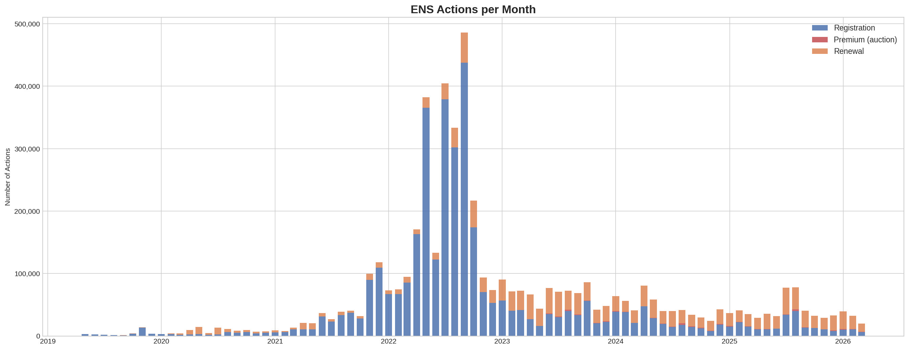
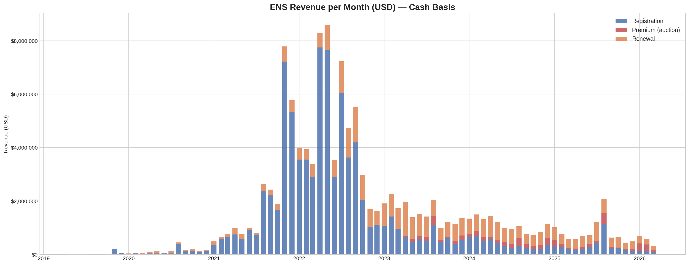
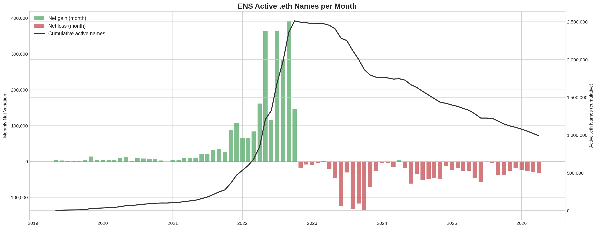
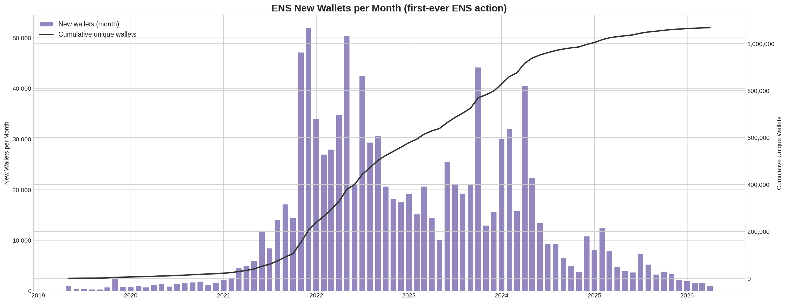
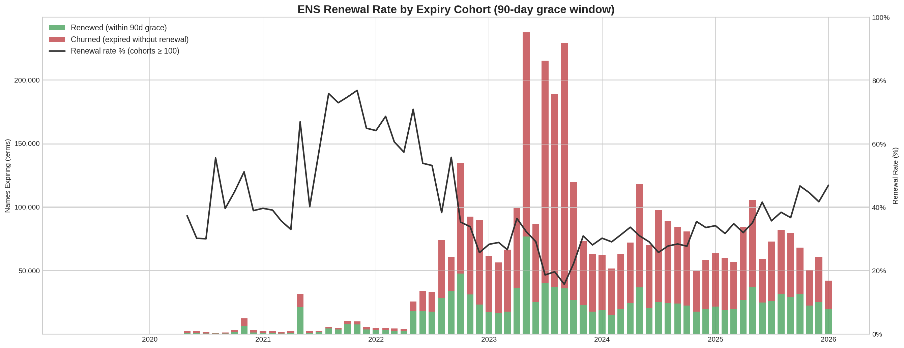
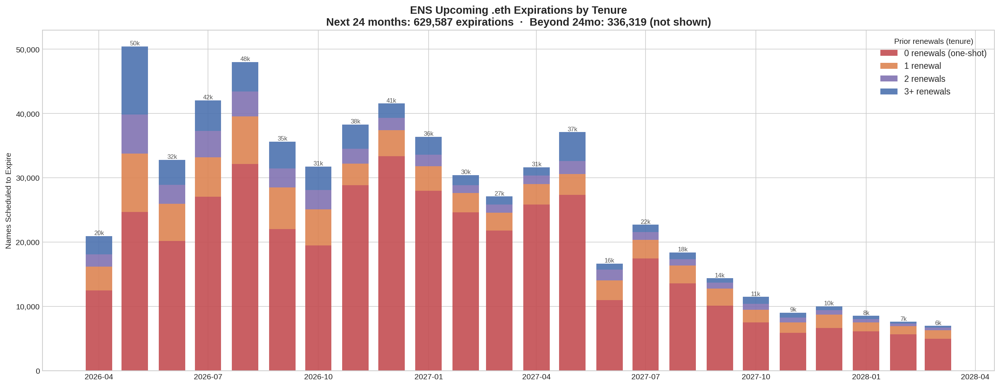

# ENS Revenue Analysis

On-chain revenue analysis of the [Ethereum Name Service](https://ens.domains) protocol, covering May 2019 through March 2026. All data is queried directly from decoded contract events on [Dune Analytics](https://dune.com) and cross-validated against [Steakhouse Financial](https://www.steakhouse.financial) (ENS's official financial advisor).













## Methodology

### Shared conventions

- **Source tables** — `ethereumnameservice_ethereum.ethregistrarcontroller_{1..5}_evt_nameregistered` and `_evt_namerenewed` (decoded events on Dune). The spellbook `ens.view_registrations` is **not** used — it misses v5 events.
- **Name identifier** — `labelhash` (varbinary, keccak256 of the label). v1–v4 store it in `label`, v5 in `labelhash`.
- **Time bucketing** — `date_trunc('month', evt_block_time)` in UTC.
- **Grace period** — 90 days after `expires`, during which the current owner can still renew. After day 90 the name is released to premium auction. Every metric that needs a "was this term continued?" decision uses this 90-day window.
- **Pre-May 2019 names** — registered on the old registrar (different contracts, not in these tables). They appear here only through post-2019 renewals. Impact is noted per metric below.

### 1. Actions per month — `sql/actions_per_month.sql`

Counts of events per month, split into three categories.

- **Registration** = `NameRegistered` with `premium = 0` (v4/v5), or the whole event for v1–v3 (no premium field — all counted as Registration).
- **Premium** = `NameRegistered` with `premium > 0` (v4/v5 only).
- **Renewal** = every `NameRenewed` event (v1–v5).

**Assumptions**

- v1–v3 events cannot distinguish standard vs premium; functionally OK because premium auctions only existed from v4.
- Re-registrations (after grace) are counted as new Registration events.

### 2. Revenue per month — USD — `sql/revenue_usd_by_category.sql`

Cash-basis revenue in ETH, converted to USD per month.

**ETH in**

| Category | v1–v3 | v4 | v5 |
|----------|-------|----|----|
| Registration | `cost / 1e18` | `baseCost / 1e18` | `baseCost / 1e18` |
| Premium | not emitted → 0 | `premium / 1e18` | `premium / 1e18` |
| Renewal | raw `cost / 1e18` | raw `cost / 1e18`, **except** Dec 2024–Sep 2025 uses curated view `dune.ethereumnameservice.result_ethregistrarcontroller4_namerenewed` (fixes known bad data) | raw `cost / 1e18` |

**USD**

`avg_price_usd` per month from `prices.usd` (WETH `0xC02aaA39…Cc2`, blockchain = `ethereum`, minute-granularity averaged to month). `revenue_usd = revenue_eth × avg_price_usd`.

**Assumptions**

- **Cash basis**: revenue is booked in the month the event fires, not amortized across the registration term.
- ETH→USD uses the month's average price, not the spot at each tx.
- Gas fees are excluded (they're ETH burned, not ENS protocol revenue).

Cross-validated 94–102% against Steakhouse Financial's CASH accounting (`dune.steakhouse.result_ens_accounting_revenues`).

### 3. Active .eth names per month — `sql/active_names_per_month.sql`

Names with a non-expired registration at each month end.

**Interval construction** — for each name, order events by time and compute `prev_max_expires = MAX(expires)` over prior rows. An event starts a *new interval* iff `prev_max_expires IS NULL` OR `prev_max_expires + 90d < evt_block_time` (grace closed before this event → re-registration). Otherwise it continues the current interval. Each interval = `[MIN(evt_block_time), MAX(expires)]`.

**Counting** — each interval emits `+1` at its start month and `-1` at `end_month + 1`. Cumulative sum = active count; month diff = net variation.

**Assumptions**

- "Active" is defined strictly by `expires > month_end`. Names in grace (expired but still redeemable) are *not* counted as active.
- The 90-day grace is used only to detect re-registrations (avoid merging a new owner's term with the prior owner's expired one).
- Future-dated `expires` are not decremented until they elapse.

### 4. New wallets per month — `sql/new_wallets_per_month.sql`

Each wallet's first-ever ENS action.

- Wallet = `evt_tx_from` on any `NameRegistered` or `NameRenewed` (v1–v5). Chosen over `owner` so that renewals also count (renewals have no `owner` field).
- Per wallet: `MIN(evt_block_time)` across all 10 tables → first-action month.
- Cumulative column = running sum.

**Assumptions**

- If an action is relayed (meta-tx / paymaster / aggregator), the **relayer** is counted, not the end user. Small effect today.
- Contract wallets (safes, multisigs) are treated the same as EOAs — whatever address is in `tx.from`.

### 5. Renewal rate per expiry cohort — `sql/renewal_rate_per_month.sql`

For each event, `expires` defines a "term". A term is *renewed* iff the same label has a **next event within 90 days after `expires`** (grace window).

- `LEAD(evt_block_time)` over `PARTITION BY labelhash ORDER BY evt_block_time` gives the next event time.
- `was_renewed = 1` iff `next_event_time IS NOT NULL AND next_event_time ≤ expires + 90d`.
- **Cohort** = `date_trunc('month', expires)`. Only cohorts where `expires < now - 90d` are reported, so the grace window is fully closed for every term in the cohort.
- `renewal_rate_pct = 100 × SUM(was_renewed) / COUNT(*)` per cohort.

**Assumptions**

- Each event is a separately-scored term. A name renewed 3 times contributes 3 terms across 3 cohorts. The rate is "fraction of terms continued", not "fraction of names still alive".
- Chart 5's line suppresses cohorts with <100 terms to avoid noise from early-era tiny samples; the stacked bars show all cohorts.

### 6. Upcoming expirations by tenure — `sql/upcoming_expirations.sql`

Future expirations for currently-active names, bucketed by prior-renewal count.

- Reuses the interval construction from (3). Keep intervals where `end_time > now`.
- **Tenure** = count of `NameRenewed` events inside that interval → bucketed as `0 / 1 / 2 / 3+`.
- Group: `(date_trunc('month', end_time), tenure_bucket)` → name counts.

**Assumptions**

- `end_time` is the exact `expires` from the latest event. Grace is *not* applied to the cohort month — a name with `expires = 2026-06-15` is bucketed into `2026-06` even though the owner can still renew through mid-September.
- Pre-2019 migrated names have under-reported tenure (old-registrar history not on chain in these tables). Verified impact: **0 misbucketed one-shots** (orphans have ≥1 renewal by definition); **≤4,235 active names (0.44%)** may sit one or two buckets too low in the renewed buckets.

Cross-validated against ENS spellbook `ens.view_expirations` (ENS-team maintained): month-level cohort counts match exactly (e.g. Jun 2026: 32,798 = 32,798; Jun 2027: 16,639 = 16,639). Residual ≤30-name deltas = time drift between query runs.

## Repository Structure

```
sql/
  actions_per_month.sql          # Action counts by category (registration/premium/renewal)
  revenue_usd_by_category.sql    # Revenue in USD with ETH→USD conversion
  revenue_per_month.sql          # Revenue from Steakhouse accounting (reference)
  active_names_per_month.sql     # Active .eth names (net variation + cumulative)
  new_wallets_per_month.sql      # First-time wallets per month
  renewal_rate_per_month.sql     # Renewal rate by expiry cohort (90-day grace)
  upcoming_expirations.sql       # Future expirations by month × tenure bucket
data/
  actions_per_month.json         # Dune query result export
  revenue_usd_by_category.json   # Dune query result export
  premium_proportion.json        # Premium share within registrations
  steakhouse_revenue.json        # Steakhouse accounting data for validation
  active_names_per_month.json    # Active names metric export
  new_wallets_per_month.json     # New wallets metric export
  renewal_rate_per_month.json    # Renewal rate metric export
  upcoming_expirations.json      # Future expirations metric export
charts/
  1_actions_per_month.png        # Stacked bar chart of monthly actions
  2_revenue_usd_per_month.png    # Stacked bar chart of monthly revenue (USD)
  3_active_names_per_month.png   # Net variation bars + cumulative active line
  4_new_wallets_per_month.png    # New wallets bars + cumulative unique line
  5_renewal_rate_per_month.png   # Renewed/churned stacked bars + rate line
  6_upcoming_expirations.png     # Upcoming expirations by tenure (next 24mo)
generate_charts.py               # Python script to regenerate charts from data/
```

## Regenerating Charts

```bash
python -m venv .venv
source .venv/bin/activate
pip install pandas matplotlib
python generate_charts.py
```
